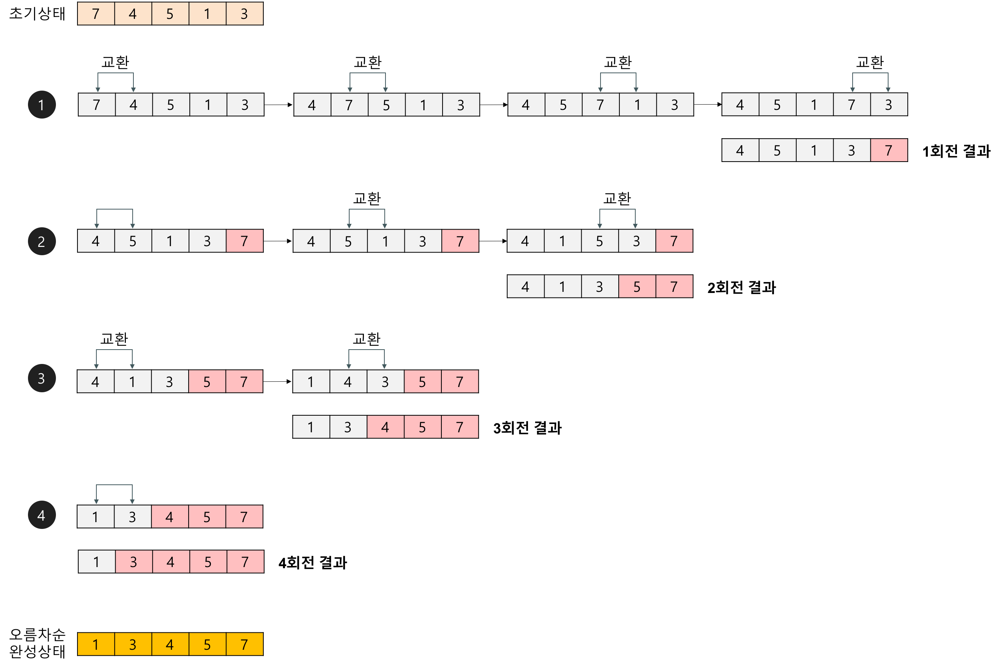

# algorithmGuide

## 공부계획
  1일 2 문제
  유명한 알고리즘 readme 기록   


### 재귀함수
  <details>
  <summary>
  하노이 탑
  </summary>
  <br>

  하노이 탑은 4가지만 기억하자.    

  탑의 높이가 n일 경우      

  1. 1개면 그냥 옮긴다.  
  2. n-1개를 중간으로 옮긴다.
  3. 바닥 판을 끝으로 옮긴다.   
  4. 중간의 n-1 개를 끝으로 옮긴다.   

  -끝-

  간단한게 최고다.   
  </details>
  <br>

### 정렬
  <details>
  <summary>
  삽입 정렬
  </summary>
  <br>
  
  원리   

      

  삽입 정렬을 구현할 때에는   
  ```java
  for (int i = 0; i < 10; i++) {
        checkInt = list[i];
        for (int j = i - 1; 0 =< j && checkInt < list[j]; j--) {
        ...
        }
  }
  ```
  같은 큰 틀에서 구현해봅시다.   
  for loop 을 역방향으로도 이동시킬 수 있다는 생각을 할 수 있어야 합니다.   
  순방향으로 1개씩 뽑고, 역방향으로 1개씩 체크하는 구조입니다.   

  시간복잡도   
  Best : O(n)   
  Avg : O(n^2)   
  Worse : O(n^2)   
  </details>
  <br>

  <details>
  <summary>
  선택 정렬
  </summary>
  <br>

  원리    

     

  선택 정렬을 구현할 때에는   
  ```java
  for (int i = 0; i < 10; i++) {
        for (int j = i; j < 10; j++) {

        }
  }
  ```
  와 같이 내부 for loop 안에 외부 for loop 의 인자가 들어갑니다.     
  앞에서부터 쌓아나가는 자료구조입니다.    

  시간복잡도   
  Best : O(n^2)   
  Avg : O(n^2)   
  Worse : O(n^2)
  </details>
  <br>

  <details>
  <summary>
  버블 정렬
  </summary>
  <br>

  원리   

     
      

  마치 버블이 위로 올라가는 것을 연상시켜서 버블 정렬이라는 이름을 갖고 있습니다.   
  선택 정렬과 달리 뒤에서부터 쌓아나가는 구조입니다.   

  시간복잡도   
  Best : O(n^2)   
  Avg : O(n^2)   
  Worse : O(n^2)   
  </details>
  <br>


